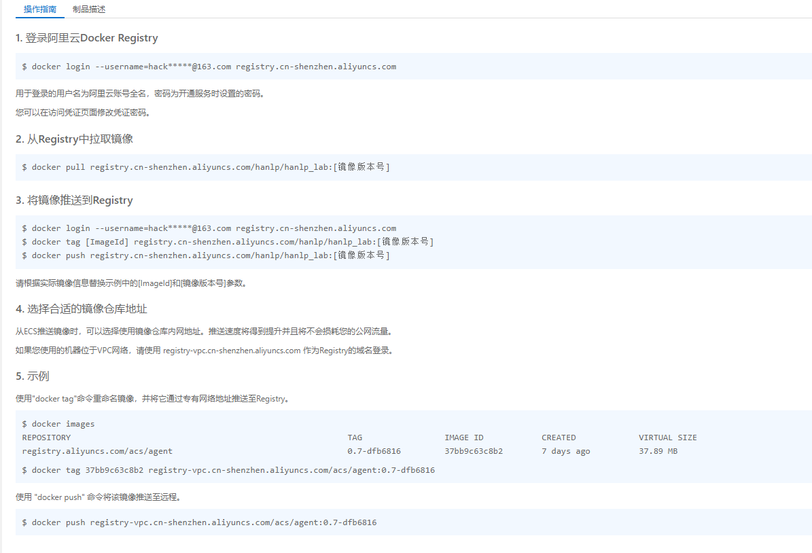
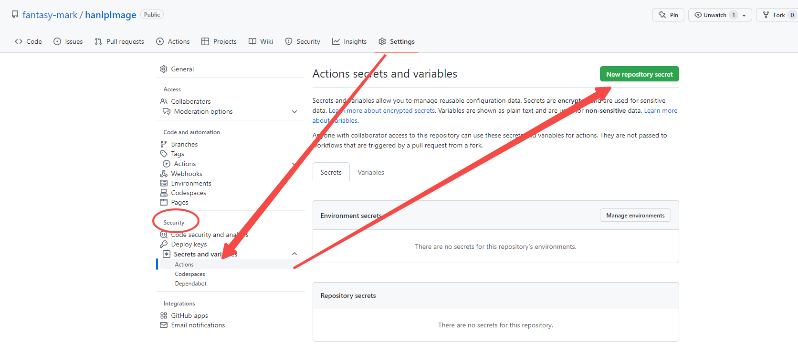
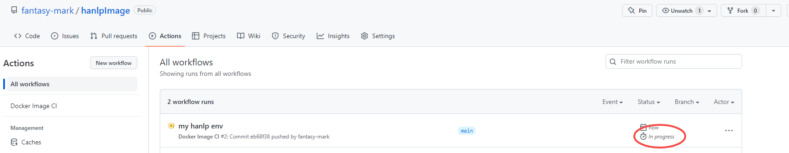

[TOC]

### 安装配置

* [官网下载](https://www.docker.com/)

* 配置代理 (Setting->Resources->Proxies) 如果无需代理访问外网则无需设置
* 共享目录 (Setting->Resources->File Sharing) 

```bash
# 挂载宿主机已共享目录到容器/share节点上
docker -it run ubuntu /bin/bash -v D:\docker:/share
```

### 使用

##### ubtun开发

```bash
# 拉取官方最新的ubuntu镜像 
docker pull ubuntu
# 运行并终端登录-退出不保存修改记录
docker run -it ubuntu /bin/bash

# 运行并终端登录
docker exec -it ubuntu /bin/bash

# 退出容器终端并停止容器运行 ctrl+q+p 或者 exit

# 查看已经运行的容器
docker ps

# 进入已经运行的容器
docker attach ContainId

# 查看容器端口映射
docker port ContainId

# 查看日志输出
docker logs -f ContainId

# 查看容器内部进程
docker top ContainId

# 拉取官方镜像
docker login
docker pull hello-world
docker images

# 通过容器创建自己的镜像 - 这里登录的是阿里云的仓库
docker login --username="hackxxxxxx.com" --password="Dxxxx02b" registry.cn-shenzhen.aliyuncs.com
docker commit ContainId ImgName
docker tag hello-world remoteSpaceName/ImgName:VersionTag
docker push remoteSpaceName/ImgName:VersionTag
# 拉取自己仓库的镜像
docker pull remoteSpaceName/ImgName:VersionTag

# 导出容器
docker export ContainId > ubuntu.tar

# 导入容器
cat docker/ubuntu.tar | docker import - mark/ubuntu:v1
# 通过url或者文件路径导入容器
docker import http://example.com/ubuntu.tar mark/ubuntu:v1
```

##### 使用仓库hanlp镜像

```bash
docker run --name hanlp -d  -p 8888:8888 registry.cn-shenzhen.aliyuncs.com/devan/hanlp-jupyterlab
# 显示日志
docker logs -f hanlp
```

##### 配置apt-get

```bash
# 更换国内阿里源
sed -i s@/archive.ubuntu.com/@/mirrors.aliyun.com/@g /etc/apt/sources.list
sed -i s@/security.ubuntu.com/@/mirrors.aliyun.com/@g /etc/apt/sources.list
apt-get clean
# 更新
apt-get update
```

----

### 进阶-自动构建

##### GitHub Actions

> GItHub Actions是一个持续集成和持续交付的平台，能够让你自动化你的编译、测试和部署流程。

* 创建一个[docker镜像仓库](https://cr.console.aliyun.com/cn-shenzhen/instance/repositories)（使用阿里云）



* 设置 `Repo Security`



* 在github上创建流水线环境

:+1: **push后会自动触发构建任务**

```yaml
name: Docker Image CI

on:
  push:
    branches: [ main ]
  pull_request:
    branches: [ main ]

jobs:

  build:
    runs-on: ubuntu-latest
    steps:
    - uses: actions/checkout@v2
    - name: Build the Docker image
      run: | 
        docker version
        # 登录阿里云镜像仓库
        docker login --username=${{ secrets.DOCKER_USERNAME }} --password=${{ secrets.DOCKER_PASSWORD }} registry.cn-shenzhen.aliyuncs.com
        # 使用Dockerfile构建镜像
        docker build . --file Dockerfile --tag registry.cn-shenzhen.aliyuncs.com/devan/hanlp-jupyterlab
        # 推送镜像到镜像仓库 - 这里对应 https://cr.console.aliyun.com/cn-shenzhen/instance/repositories
        docker push registry.cn-shenzhen.aliyuncs.com/hanlp/hanlp_lab
```

* 推送对应 `Dockerfile` 来进行构建

```dockerfile
FROM python:3.9.0

RUN pip --no-cache-dir install hanlp[full]

RUN pip install jupyterlab

WORKDIR /jupyter

EXPOSE 8888

CMD ["bash", "-c", "jupyter lab --notebook-dir=/jupyter --ip 0.0.0.0 --no-browser --allow-root"]

```

:+1:出现以下说明流水线已经自动跑起来了



---

### [play-with-docker](https://labs.play-with-docker.com/)

---

### docker-compose

##### Step 1: Define the application dependencies

1. Create a directory for the project:

   ```bash
   $ mkdir composetest
   $ cd composetest
   ```

2. Create a file called `app.py` in your project directory and paste the following code in:

   ```python
   import time
   
   import redis
   from flask import Flask
   
   app = Flask(__name__)
   # 通过与容器名相同的域名可访问对应容器(compose自动生成)
   cache = redis.Redis(host='redis', port=6379)
   
   def get_hit_count():
       retries = 5
       while True:
           try:
               return cache.incr('hits')
           except redis.exceptions.ConnectionError as exc:
               if retries == 0:
                   raise exc
               retries -= 1
               time.sleep(0.5)
   
   @app.route('/')
   def hello():
       count = get_hit_count()
       return 'Hello World! I have been seen {} times.\n'.format(count)
   ```

3. Create another file called `requirements.txt` in your project directory and paste the following code in:

   ```kotlin
   flask
   redis
   ```

##### Step 2: Create a Dockerfile

The Dockerfile is used to build a Docker image. The image contains all the dependencies the Python application requires, including Python itself.

In your project directory, create a file named `Dockerfile` and paste the following code in:

```dockerfile
# syntax=docker/dockerfile:1
FROM python:3.7-alpine
WORKDIR /code
ENV FLASK_APP=app.py
ENV FLASK_RUN_HOST=0.0.0.0
RUN apk add --no-cache gcc musl-dev linux-headers
COPY requirements.txt requirements.txt
RUN pip install -r requirements.txt
EXPOSE 5000
COPY . .
CMD ["flask", "run"]
```

##### Step 3: Define services in a Compose file

Create a file called `docker-compose.yml` in your project directory and paste the following:

```yaml
version: "3.9"
services:
  web:
    build: .
    ports:
      - "8000:5000"
  redis:
    image: "redis:alpine"
```

This Compose file defines two services: `web` and `redis`.

The `web` service uses an image that’s built from the `Dockerfile` in the current directory. It then binds the container and the host machine to the exposed port, `8000`. This example service uses the default port for the Flask web server, `5000`.

The `redis` service uses a public [Redis](https://registry.hub.docker.com/_/redis/) image pulled from the Docker Hub registry.

##### Step 4: Build and run your app with Compose

1. From your project directory, start up your application by running `docker compose up`.

```
$ docker compose up

Creating network "composetest_default" with the default driver
Creating composetest_web_1 ...
Creating composetest_redis_1 ...
Creating composetest_web_1
Creating composetest_redis_1 ... done
Attaching to composetest_web_1, composetest_redis_1
web_1    |  * Running on http://0.0.0.0:5000/ (Press CTRL+C to quit)
redis_1  | 1:C 17 Aug 22:11:10.480 # oO0OoO0OoO0Oo Redis is starting oO0OoO0OoO0Oo
redis_1  | 1:C 17 Aug 22:11:10.480 # Redis version=4.0.1, bits=64, commit=00000000, modified=0, pid=1, just started
redis_1  | 1:C 17 Aug 22:11:10.480 # Warning: no config file specified, using the default config. In order to specify a config file use redis-server /path/to/redis.conf
web_1    |  * Restarting with stat
redis_1  | 1:M 17 Aug 22:11:10.483 * Running mode=standalone, port=6379.
redis_1  | 1:M 17 Aug 22:11:10.483 # WARNING: The TCP backlog setting of 511 cannot be enforced because /proc/sys/net/core/somaxconn is set to the lower value of 128.
web_1    |  * Debugger is active!
redis_1  | 1:M 17 Aug 22:11:10.483 # Server initialized
redis_1  | 1:M 17 Aug 22:11:10.483 # WARNING you have Transparent Huge Pages (THP) support enabled in your kernel. This will create latency and memory usage issues with Redis. To fix this issue run the command 'echo never > /sys/kernel/mm/transparent_hugepage/enabled' as root, and add it to your /etc/rc.local in order to retain the setting after a reboot. Redis must be restarted after THP is disabled.
```

2. Enter http://localhost:8000/ in a browser to see the application running.

   If this doesn’t resolve, you can also try http://127.0.0.1:8000.

   You should see a message in your browser saying:

   ```
   Hello World! I have been seen 1 times.
   ```

##### Step 5: Edit the Compose file to add a bind mount

Edit `docker-compose.yml` in your project directory to add a [bind mount](https://docs.docker.com/storage/bind-mounts/) for the `web` service:

```yaml
version: "3.9"
services:
  web:
    build: .
    ports:
      - "8000:5000"
    volumes:
      - .:/code
    environment:
      FLASK_DEBUG: "true"
  redis:
    image: "redis:alpine"
```

The new `volumes` key **mounts the project directory (current directory) on the host to `/code` inside the container, allowing you to modify the code on the fly**, without having to rebuild the image. The `environment` key sets the `FLASK_DEBUG` environment variable, which tells `flask run` to run in development mode and reload the code on change. This mode should only be used in development.

##### Step 6: Re-build and run the app with Compose && change `app.py`

Change the greeting in `app.py` and save it. For example, change the `Hello World!` message to `Hello from Docker!`:

```python
    #return 'Hello World! I have been seen {} times.\n'.format(count)
    return 'Hello from Docker! I have been seen {} times.\n'.format(count)
```